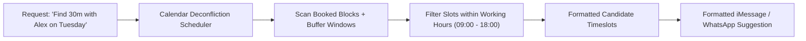

# genpark-autonomous-calendar-deconfliction-scheduler-skill

> Autonomous Calendar Deconfliction Scheduler with Buffer Guarantees. 100% Python Standard Library.

Distilled from **Shuffle**, providing autonomous multi-party scheduling negotiation directly inside messaging channels without requiring external calendly links.

## Architecture

## Features
- **Buffer Invariant**: Guarantees recovery time between consecutive meetings.
- **Lightweight & Standalone**: Zero third-party calendar client lock-in.
